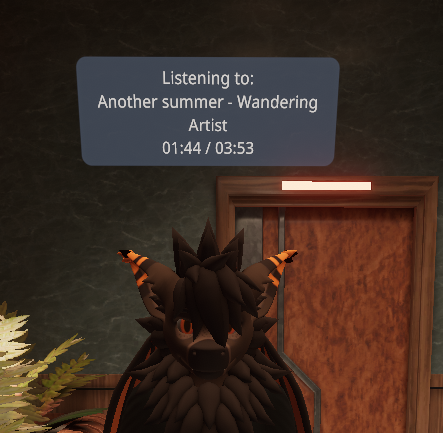

# SqueakNowPlaying 🦇
A simple _(and janky)_ command-line Python app that reads track data from the Windows SMTC and broadcasts it over [OSC](https://en.wikipedia.org/wiki/Open_Sound_Control)

Showcase your favorite music to others in your favorite Social VR applications!

## Resonite
SqueakNP is fully supported in Resonite via the **SqueakNowPlaying UI**.</br>


## VRChat
SqueakNP supports **VRChat's Chatbox** feature, allowing other players to see what you're listening to in real-time.



# How to Install
> <sub>⚠️ You must be running Windows 10 or Windows 11 to use SqueakNP.</sub>
<sub>Older or Alternative Operating Systems are untested and likely unsupported.</sub>
<sub><sub></br>*Sorry Linux friends, you'll get some appreciation sooner or later!*</sub></sub>

**Since SqueakNP is not self-packaged yet, you're going to have to setup Python on your system.**</br>
1. Grab the latest Python 3.1x at the [Official Website](https://www.python.org/downloads/) or from the [Microsoft Store](https://apps.microsoft.com/detail/9PNRBTZXMB4Z?hl=en-us&gl=US&ocid=pdpshare)</br>
2. Once it's installed, go ahead and grab the latest SqueakNP by clicking the green "Code" button at the top right and pressing "Download Zip".</br>
<sub>*If you're familiar with GitHub, just clone the repo with whatever you like!</br>
3. Extract the zip file, and open a Terminal window to it.</br>
Make sure the Terminal's path is set to where all files are, instead of just the subfolder.</br>

4. Create a new Virtual Environment with the following command.
```
python3 -m venv env
```
5. You should see a new folder appear called "env", now we can install the required dependencies to it!
```
"env\Scripts\pip.exe" install -r requirements.txt
```
If you saw no errors during this process, congrats! You've got all the dependencies installed, and now you can run SqueakNP by running "start.bat"!</br>

## Setup for VRChat
**SqueakNP requires manually enabling VRChat's Chatbox support.**</br>
If you've ran SqueakNP for the first time, you should see a new file named "squeakconfig.cfg"</br>
Right-click it and open it with Notepad _(or any preferred text editor)_ and set the **port** value to **9000** instead of **9025**.</br>
Then, in the very bottom of the file there should be a section titled VRChat. Change the **enabled** value to **true** and you should be all set!

## Using Last.fm for Album Artwork fetching
**SqueakNP supports [Last.fm](https://www.last.fm/) for showing album artwork in Resonite!**</br>
To setup album artwork, visit https://www.last.fm and create an account there.</br>
Then, once you verify your email, head to https://www.last.fm/api/account/create to obtain your API Key.</br>
Make sure to name the application accordingly and set the Callback URL to http://localhost</br>
Once you've gotten your API Key, paste the key and your Last.fm username into the fields in **squeakconfig.cfg**

<sub>Last.fm support was added via a generous code donation from [@EuphieEuphoria](https://github.com/EuphieEuphoria), go send some love and support to him! 🧡</sub>
